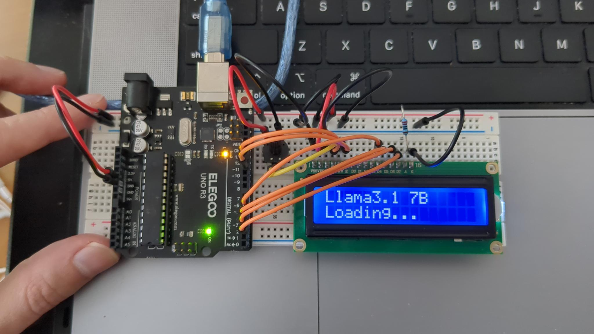

Stream text or Ollama to a 16x2 LCD display using an ATmega328P microcontroller.
No arduino abstractions, no external libraries, just direct register manipulation.



## Compile

```bash
avr-gcc -mmcu=atmega328p -DF_CPU=16000000UL -Os -c main.c -o main.o
```

## Convert

```bash
avr-gcc -mmcu=atmega328p main.o -o main.elf
```

```bash
avr-objcopy -O ihex -R .eeprom main.elf main.hex
```

## Flash

```bash
avrdude -p atmega328p -c arduino -P /dev/tty.usbmodem101 -b 115200 -U flash:w:main.hex:i
```

## Run a client

```bash
python simple-client.py
```

```bash
python ollama-client.py
```
